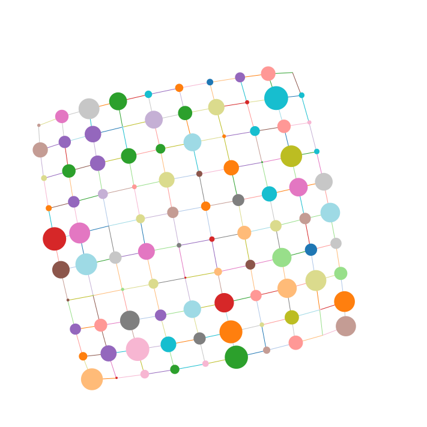

# ngraph.fabric

This is a 2d graph renderer, which uses [Fabric.js](https://github.com/kangax/fabric.js) as a rendering engine. This library is a part of [ngraph](https://github.com/anvaka/ngraph) project. 
[](http://anvaka.github.io/ngraph.fabric/example/customUI/)

NB: Image above was [rendered from Node.js](https://github.com/anvaka/ngraph.fabric/blob/master/example/node.js/innode.js). Click on the image to see interactive version rendered by the same code in your browser.

# Example
This code will render interactive graph:

``` js
  // let's create a simple graph with two nodes, connected by edge:
  var graph = require('ngraph.graph')();
  graph.addLink(1, 2);

  // Create a fabric renderer:
  var fabricGraphics = require('ngraph.fabric')(graph);

  // And launch animation loop:
  fabricGraphics.run();
```

Use mouse wheel to zoom in/zoom out, drag canvas/nodes with left mouse button. More examples are available in the [examples](examples) folder. You can also play with browserified examples here:

* [Default UI rendering](http://anvaka.github.io/ngraph.fabric/example/basic/)
* [Custom look and feel for nodes and links](http://anvaka.github.io/ngraph.fabric/example/customUI/)
* [Add/remove graph's elements dynamically](http://anvaka.github.io/ngraph.fabric/example/dynamic/)
* [Hover mouse over a node to get a wave](http://anvaka.github.io/ngraph.fabric/example/interactive/)

# Customization

There are many ways to customize fabric graphics. I made them symmetrical to `ngraph.pixi` graphics. See [README](https://github.com/anvaka/ngraph.pixi#customization) for more details.

# What is missing?

If you like fabric.js and want to help with graph rendering, your 
contribution is absolutely welcomed and appreciated.

If you know how to improve rendering speed with `fabric.js` please let me know.
Currently it does not handle well graphs with more than 500 node and 1000 links.

# Why fabric?
Fabric has very well [documented API](http://fabricjs.com/) and you can use any of those primitives as
your rendering tools. What makes it absolutely awesome: Same code can be executed
in the browser and on the server using `node.js`. Thus you can reuse code to render
static images of graphs or animate them in the browser.

# install

With [npm](https://npmjs.org) do:

```
npm install ngraph.fabric
```

# license

MIT
